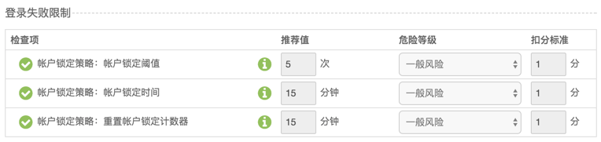
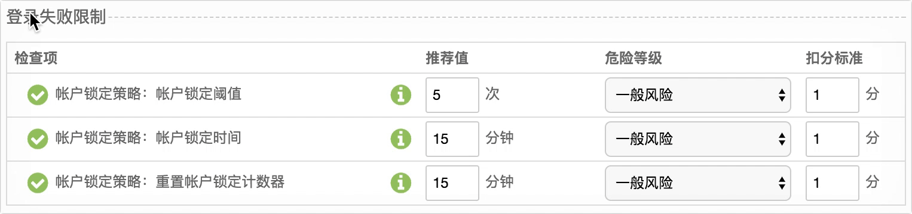

## ETA策略前端

> ### 业务场景

编辑对应的策略生成终端的评分标准, 暂时分成`系统安全`, `数据安全`, `管控合规`

**系统安全**

* 需要启用`屏幕保护程序`
* 密码需要超过8个字符
* 禁止远程桌面共享
* ...

**数据安全**

* 文件不能包含某些关键字
* 上网不能包含某些网站
* ...

**管控合规**

* 不能存在某些进程之类的
* 也不能包含某些软件
* ...

这些都只是部分策略项, 差不多有100项左右, 不排除后面的更新, 所以`可维护性`比较重要的。整一个项目更多是对数据的加载映射到对应Form项, 然后操作Form对数据进行修改, 最后保存, 把修改的数据发送给服务端接收, 客户端通过心跳机制跟服务端获取。


> ### 技术选型

* **原则**
  
  不是为了去追风, 而是要切合业务实际

* **比较**
  
  * React: 在操作很多form组件的时候需要很多事件的监听;
  * Avalon: 文档缺失, 生态不如vue, 很多功能跟vue类似;
  * **Vue**: 
     * 文档健全
     * 维护活跃
     * MVVM 
     * 组件化 
     * 虚拟DOM
     * 编译时

* **结果** 
  
  基于上面的原因, 最后我们选中**Vue**作为ETA策略的基础开发工具, 配合`webpack` `vue-loader`来构建。
 
 
> ### 问题

| 问题 | 详细 | 解决方案 | 
|:---:|:---:|:---:|
| `策略项多` | 上百个, 后续会持续增加 | 组件化, MVVM | 
| `联动` | 上下级联动, 比如不勾选就置灰下级 | MVVM, fieldset |
| `兼容性`| `新控制台 --> 旧终端` `旧控制台 --> 新终端` | 对象颗粒度, 版本化|

现在我们来对这些问题一一分解, 这里咱们先插入一个为什么需要存在MVVM, 这个是整一个架构的**基础**。从初始化加载数据, 如何映射到对应的DOM节点? 

**jQuery**

HTML

```html
<input type="checkbox"/>
```

Data

```js
enable
```

JavaScript

```js
// 根据enable值来设置checkbox的勾选状态
var $checkbox = $('input[type=checkbox]');
var data = null;

(function init() {
  fetch(url).then(res => {
    data = res.data;
    $checkbox.prop('checked', data.enable);
  });
  
  initEvent();
})()

function initEvent() {
  $checkbox.on('change', () => {
    data.enable = $checkbox.prop('checked');
  });
}
```

**MVVM**

```html
<input type="checkbox" v-model="enable"/>
```

但是在页面复杂再加上数据多的话, jQuery的问题就越来越严重, 需要找到对应的元素然后监听事件处理, 这个时候如果还有联动问题呢? 如下面的例子: 勾选上面的checkbox, 才能对输入框进行编辑, 如果有多个需要联动呢? 如果还需要对每一个元素对应的值进行设置呢? 

```html
<input type="checkbox" />
<div>
  <input type="text">
</div>
```
上面说的情况用jQuery感觉要哭了吧。所以我们强行引入**MVVM**。


> ### 组件设计

为了解决策略项多的问题我们还需要引入组件化, 这个比较抽象的概念, 也是有很多很灵活的想法。首先我们要对它们进行分类才能针对不同的组件做不同的处理。

组件可以分成 **基础组件** **通用组件** **业务组件** 

| 组件类型 | 使用频率 | 修改权限 | 通用性 | 灵活性 | CSS权重 | 作用域 |
| ------| ------ | ------ | ------ | ------ |------ | ------ |
| 基础组件 | 高 | 高(不能随便修改) | 高 | 高 | 低 | 跨项目 |
| 通用组件 | 中 | 中 | 中 | 中 | 中 | 跨页面 |
| 业务组件 | 低(一次性) | 低 | 低(具象) | 低 | 高(最好有命名空间) | 单页面 |

下面举一个例子是处理通用组件的, 比如在系统安全检测有一些table, 而且它的列基本上是一致的, 有检查项, 推荐值, 危险等级, 扣分标准。但是其实这个只是在咱们这个策略有公用的情况, 但是到了其他项目其实就是没啥用了。就是下面的图片: 



```html
<template>
	<div>
		<div class="section-title">
			<h4>{{ title }}</h4>
		</div>
		<table class="policy-section">
		    <thead>
				<tr>
					<th width="46%">检查项</th>
					<th width="20%">推荐值</th>
					<th width="16%">危险等级</th>
					<th>扣分标准</th>	
					<!-- <th>处理方式</th> -->
				</tr>
		    </thead>
		    <tbody>
		    	<slot></slot>
		    </tbody>
		</table>
	</div>
</template>
```

* `title`是指上面的**登录失败限制**之类的
* `thead > tr`统一了表头
* `slot` tbody通过可以让别人自定义slot

在这里我们还可以发现其实`tbody`的每一列也是有相似点的。咱们可以看下动图



* 勾选按钮是可以控制推荐值等其他项的操作
* 有tip显示内容
* 扣分标准输入框一致, 内容不太一致

所以我们有抽出来了一层, 相关文件是`EvalItem.vue`

```html
<template>
	<FieldSetter :disabled="rule.lock==1">
		<tr :id="id" :class="{ disabled: rule.enable!=1 }">
			<td>
				<EvalTooltip :content="$map.tooltip[id]">
					<i :data-id="id" class="fa fa-info-circle pull-right"></i>
				</EvalTooltip>
				<!-- 后续有配置约束模板 -->
				<!-- 
					<i class="fa fa-lock pull-right" :class="lockedClass" 
						:title="restrained && rule.lock==2 ? '上级已配置约束' : ''"
						@click="restrained && dealLock(rule)"></i>
				 -->
				
				<!-- 添加button是为了会被全局的fieldset disabled属性限制 -->
				<button @click="dealEnable(rule)">
					<i class="fa fa-check-circle" :class="{ on: rule.enable==1 }"></i>
				</button>

				<!-- 检查项名字 -->
				<slot name="name"></slot>
			</td>
			
			<FieldSetter ref="recWrapper" :disabled="rule.enable!=1">
				<!-- 推荐值 -->
				<td ref="rec">
					<slot name="rec" :rule="rule"></slot>
				</td>
			</FieldSetter>
			
			<FieldSetter :disabled="rule.enable!=1">
				<!-- 危险等级 -->
				<td>
					<select v-model="rule.level">
						<option value="0">潜在风险</option>
						<option value="1">一般风险</option>
						<option value="2">严重风险</option>
					</select>
				</td>
			</FieldSetter>

			<FieldSetter :disabled="rule.enable!=1">
				<!-- 扣分标准 -->
				<td>
					<input type="text" class="num" verify="int" verify-min="1" verify-max="100"
						verify-label="扣分标准" maxlength="6" v-model="rule.score">
					<span>分</span>
				</td>
			</FieldSetter>
			<!-- <td>
				<select v-model="rule.auto_fix">
					<option value="1">自动</option>
					<option value="0">手动</option>
				</select>
			</td> -->
		</tr>
	</FieldSetter>

</template>
```

这样子抽离出来一个是为了复用性, 另外一个重要功能就是可以提高维护性。因为比如之前是有加上自动/手动的功能, 然后产品同学说不要了, 所以我们需要去掉了。 如果我们都分散出来的话就会导致需要修改了很多个地方, 但是我们独立出来的话, 就只需要在`EvalItem.vue`注释下代码就行了。

**组件思路**
  
* 单一职责 比如table不应该去做Ajax请求的功能;
* 分层明显 比如table可以分成header body foot, 而且暴露出来给别人去定制化;
* 尽量使用slot, 灵活性更好, 比如popup的内容;
* 组件不能包括着布局;
* 基础组件要有一个可以定制化class的入口;
* 组件可以默认帮我做事情, 但是最好也能提供一个入口不帮我做;
* 提供默认, 但是要可以让使用者选择性覆盖, 有点继承多态的感觉 比如: 
  
    ```js
    <v-table ...props></v-table>
    ```
   
   ```js
   <v-table ...props>
        <!--暴露出v-thead让别人去定制化, 然后再扔进来-->
   		<v-thead slot="v-thead"></v-thead>
   </v-table>
   ```


> ### 联动

对于上面那种情况, 也就是点亮打勾的话, 会影响后面form表单的状态, 因为咱们知道vue会帮我们依赖收集, 所以处理起来很简单。比如打勾对应的数据是lock, 后面的form元素加上对应的`:disabled="lock==0"`的属性就行了。但是如果影响面太大呢? 比如存在某一个影响整一tab里面的form表单元素或者整一个页面的form表单元素。

#### 联动元素多

我们可以通过MDN看到fieldset的disabled属性

> If this Boolean attribute is set, the form controls that are its descendants, except descendants of its first optional <legend> element, are disabled.

就是我设置了fieldset的disabled属性的话, 可以影响到它的子孙form表单元素。所以我们只需要修改fieldset的disabled属性就行了。

#### 事件处理

咱们在看看上面那个EvalItem.vue

```html
<!-- 添加button是为了会被全局的fieldset disabled属性限制 -->
<button @click="dealEnable(rule)"> 
  <i class="fa fa-check-circle" :class="{ on: rule.enable==1 }"></i>
</button>
```
对于一些图标, 但是它是有点击效果的, 后续全局disabled的话, 它是不可以操作的. 所以咱们在它外面包一次button, 然后在button添加事件。因为button是表单元素, 所以当全局的fieldset修改了disabled了, button浏览器会帮我们处理的。

#### 表格

继续看下`EvalItem.vue`, 咱们知道上面说的表格也有这种联动的情况, 那怎么办呢? 也加上fieldset? 不行的呢, 加上之后就会出现表格乱套了。所以就自定义一个组件, 只做透传, 但是功能跟fieldset类似。`FieldSetter.vue`, 不用vue的template, 在初始化`mounted`跟`updated`都加上对应的设置

```js
<script>
	export default {
		name: 'FieldSetter',
		
		props: {
			disabled: Boolean,
			not: String
		},
		
		// 做到透传
		render(createElement) {
			// 子元素只能是一个
			var slot = this.$slots.default[0];
			return createElement(slot.tag, {...slot.data}, slot.children)
		},

		methods: {
			setDisabled() {
				this.formControl.forEach(c => {
					if (c.disabled != this.disabled) {
						c.disabled = this.disabled
					}
				});
			}
		},

		mounted() {
			const control = ['input', 'button', 'select'];
			// 可以去掉不需要控制的元素
			const nots = [].slice.call(this.$el.querySelectorAll(this.not));
			
			const children = this.$children.filter(c => {
				return c.$vnode.componentOptions.tag === 'FieldSetter'
			});

			this.formControl = [].slice
				.call(this.$el.querySelectorAll(control.join(',')))
				// 去掉子元素为FieldSetter监控的元素, 使用可以参考 EvalItem
				.filter(el => children.every(c => !c.$el.contains(el)))
				.filter(el => nots.every(notEl => notEl != el))
			
			this.setDisabled()
		},

		updated() {
			const children = this.$children.filter(c => {
				return c.$vnode.componentOptions.tag === 'FieldSetter'
			});

			this.setDisabled();
		}
	}
</script>
```

> ### 兼容性

#### 旧策略 新控制台

比如上面某一个checkbox, 本来是用enable来表示的, 但是突然产品同学说需要加上一个锁🔒, 功能是可以对这个选项进行锁定, 不能让其他人随意开启, 也就是加上权限。这个时候一个enable的值是不能表示两个状态的, 所以就有点懵逼了。修改策略格式的话, 比如改成

```js
data: {
  enable: true,
  lock: false
}
```
后面如果是旧策略对应新控制台的话, 就导致它丢失了原有的选项, 或者前端直接报错。所以我们做到颗粒度为对象就可以解决这个问题了。另外一个问题是后续如果有添加策略选项的话, 但是旧策略没有这个值, 需要服务端那边对默认策略的合并。

之前在做这个策略的时候, 在策略数据的设计方面上有很多需要权衡, 在扩展性与方便性做取舍。

* **原则**

  * 最小颗粒度为对象, 防止后面加上锁或者其他扩展性标记;
  * 减少**二进制**的数据表现方式, 不太灵活, 比如添加删除某一项或者弄乱顺序;
  
* **优缺点**
  
  * 优点: 扩展性, 维护性是我们首要选择
  * 缺点: 增加HTTP传输负荷,而且终端并不感知
  

#### 新策略 旧终端

加上版本号控制

> ### 整体设计

#### 目标
  
  * `维护性`与`扩展性`是首选
  * `拆分` 分而治之
  * `统一管理` 抽离组件, Map
  
#### 细节

1. Store模仿`Vuex`, 全局; 原理就是在每一个组件创建的之前加上一个钩子, 然后去找store, 没有的话就继续跟它的父节点拿。
  
    ```js
    var Store = {};
	Store.install = (Vue, options) => {
		Vue.mixin({
			beforeCreate() {
				const options = this.$options;
				if (options.store) {
					this.$store = options.store;
				} else if (options.parent && options.parent.$store) {
					this.$store = options.parent.$store;
				}
			}
		});
	};
    ```
    
2. `computed`做到数据分发, 方便对数据的引用;
3. 不用单向数据流, 不太符合策略这边的场景, 只用`MVVM` + `Pub/Sub`;
4. 数据与展现分离(`Tooltip`里面的内容);
5. URL, 提示等常量统一管理;
6. 通过plugin的方式加上工具类(`post`, `get`)或者数据层(`Store`)等, 在上层添加工具类等方便以后修改不需要进入各个组件内部;
  
> ### Vue感受

* 一开始对开发者相当友好, 封住的一些指令(v-for, v-model)对于正常的书写少了很多步骤;
* MVVM概念在表单处理方面简单有效, 效率高;
* 周边的套件也是相当丰富, 比如vue-loader, vuex, element等, 但是跟react比真的是小巫见大巫了, 特别当你google时候;
* 偏向于OOP, 所有的组件都继承于Vue对象, 所以可以在Vue.prototype上面添加对应的自定义内容;
* 加上vue-loader区分了编译时与运行时, 语法糖就在编译时处理, 不在运行时处理;
* 思想不太统一, 比如有了MVVM然后还有Vuex, 有了template还有render函数或者jsx等;
  
> ### 总结

针对策略的特性, 我们选择了MVVM为基础的框架。可维护性是我们优先考虑的, 我们的关注点会放在`统一管理`还有`分而治之`。为了实现这些我们就需要加上编译时, 还有在代码层面的抽象组件。`编译时` + `组件化` + `双向绑定`是`Vue`具备的, 所以我们选择了`Vue`这个框架来进行开发。`分而治之`一个很重要的一点那就是模块化, 会以每一个Tab为单位, 然后再继续在里面找到组件的共同点。这个组件化既能满足`分而治之`又能满足`统一管理`。比如下次对该组件的功能添加, 如果我之前没有对这个组件做出抽离的话, 全部耦合到业务组件里面, 那么如果我40个业务组件是有存在类似展现和行为的, 可能会导致你可能需要修改40个业务组件。但是我们把它抽离了, 就只需要修改一个地方了。`统一管理`还存在对一些常量的管理, 比如URL, Tip提示语等等, 这样子修改的话, 我不需要去深入到代码层面去。

在这里还要涉及下对数据流的处理, 不用单向数据流, 加上action层更多是对行为的监控, 便于回溯, 可玩性很好。但是在这个策略就不打算加上这一层了, 更多是需要双向绑定, 不想自己绑定事件, 不然会写很多事件监听。所以全局登记一个Store然后一步一步传给各个组件, 通过`Computed`来分发每个组件的数据。